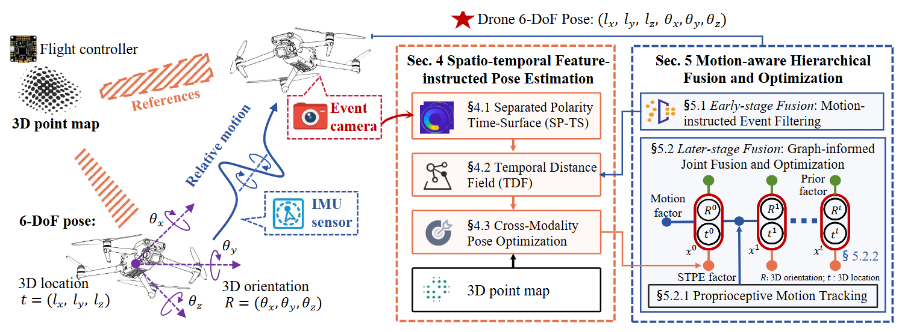

# 🚁 EV-Pose: Event-enhanced Visual Positioning Service


[](#)
[](#)
[](#)

**EV-Pose** is the first event camera-enhanced Visual Positioning Service (VPS) designed to deliver drift-free, absolute global coordinates at ultra-high frequencies for drones. This repository provides the reference implementation for evaluation.

> **⚠️ Implementation Note (Please Read First):** > 
To facilitate the peer-review process, this repository provides the reference implementation of the EV-Pose system, encompassing the core algorithmic pipeline (the STPE and MHFO modules). As this codebase supports ongoing academic research, it is actively maintained and subject to continuous refinement. 
Given the massive scale of the raw datasets and the intricate, hardware-specific ROS configurations, delivering a plug-and-play reproducible container is impractical at this stage. 
Instead, we have made the source code available for your architectural inspection and verification. 
Upon the paper's acceptance, a fully documented evaluation suite—including reproducible environments and sample datasets—will be officially released to the community.


---

## 0. System architecture

Real-time 6-DoF drone pose tracking enables precise flight control and accurate drone landing.
With the widespread availability of urban 3D maps, the Visual Positioning Service (VPS) has been adapted for drone landing to overcome GPS unreliability, serving as a global localization system that yields absolute global coordinates by continuously aligning visual features with the prior 3D map.
However, deploying conventional vision-based VPS on highly dynamic drones faces bottlenecks in both pose estimation accuracy and efficiency.
In this work, we pioneer EV-Pose, an event camera-enhanced VPS designed to deliver drift-free, **absolute global coordinates** at ultra-high frequencies for drones. 
EV-Pose addresses the 2D-3D modality gap via a novel **Spatio-Temporal Feature-instructed Pose Estimation** module, which extracts a **Temporal Distance Field (TDF)** to enable continuous, differentiable matching with a prior 3D point map for pose estimation. 
To fully exploit this formulation, we propose a **Motion-aware Hierarchical Fusion and Optimization** scheme. 
This architecture utilizes onboard IMU motion information for fine-grained early-stage event filtering and seamlessly optimizes pose estimation in a later-stage factor graph.
Evaluation shows that EV-Pose achieves a rotation accuracy of 1.76° and a translation accuracy of 7.5mm with a latency of 10.08ms, outperforming baselines by >40% and enabling accurate drone landings.

---

## 📦 1. Prerequisites

We strongly recommend using **Ubuntu 18.04 / 20.04** with a properly configured **ROS** environment.

### Quick Installation via `apt` (Recommended)
For Debian/Ubuntu-based systems, you can install most of the required dependencies using the command line:

```bash
sudo apt-get update
# Install OpenCV and Eigen3
sudo apt-get install libopencv-dev python3-opencv libeigen3-dev
# Install PCL (Point Cloud Library)
sudo add-apt-repository ppa:v-launchpad-jochen-sprickerhof-de/pcl
sudo apt-get update
sudo apt-get install libpcl-dev
```

### Install Pangolin (From Source)
Pangolin is required for trajectory and point cloud visualization. Please install it from the source:

```bash
git clone https://github.com/stevenlovegrove/Pangolin.git
cd Pangolin
mkdir build && cd build
cmake ..
make -j$(nproc)
sudo make install
```
*(Note: If you encounter issues or prefer custom builds for OpenCV/PCL, please refer to their respective official documentation.)*

---

## ⚙️ 2. Build the Project

Clone the repository and build the ROS workspace using the provided script:

```bash
# Clone the repository
git clone https://github.com/HaoyangWang00/EV-Pose
cd EV-Pose

# Grant execution permission and build
chmod +x build_all.sh
source build_all.sh
```

---

## 📝 3. Configuration Guide

Before running the evaluation, you must configure the parameters in your `.yaml` config file. Below are the key parameters you need to modify:

| Parameter | Description |
| :--- | :--- |
| `pcd_path` | The absolute path to your global 3D point cloud map directory or file. |
| `bag_path` | The absolute path to the ROS bag containing the event stream and IMU data. |
| `start_time` | The starting timestamp to initialize the pose. It represents the timestamp of the first shot when building the map. *(Note: We provide a series of `start_time` reference values in the `config/` folder for public datasets).* |

---

## 🏃 4. Run EV-Pose

We take the **VECtor dataset** as an example. Ensure your ROS environment is sourced correctly before proceeding.

**Step 1: Start the ROS master**
Open a new terminal and run:
```bash
roscore
```

**Step 2: Launch EV-Pose**
Open another terminal, navigate to your workspace, and run the main node with your configured yaml file:
```bash
rosrun demo run /path/to/your/config.yaml
```

**Step 3: Terminate the program**
To forcefully stop the evaluation, you can use:
```bash
killall -9 run
```

